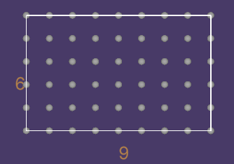

<h1>Welcome to EZ Indexing!</h1>
This is a library for spatial indexing, its written in C# and can be found on the Unity Asset Store. This document is a tutorial on the library. EZIndex offers 3 different indexable domains, 2D grids, 3D lattices, and Spherical "grids". 

<h2>2D Grids and 3D Lattices</h2>

 <br/>
This is how you would iterate nodes in a 9x6 grid centered at the origin
```C#
using EZ.Index;

/* Code */

var ratio = new float2(9, 6);
var total = Grid.GetTotal(ratio, Domain.Centers);
for (int n = 0; n < total; n++)
{
  var node = Grid.CenterNode(in n, in ratio);
}
```
<br/>
 <br/>
To achive something similar in 3D, you would simply change the 2 calls to Grid with Lattice, and use float3 for the ratio:
```C#
var ratio = new float3(9, 6, 6);
var total = Lattice.GetTotal(ratio, Domain.Centers);
for (int n = 0; n < total; n++)
{
  var node = Lattice.CenterNode(in n, in ratio);
}
```
<h2>Spherical Domain</h2>

 <br/>
The Spherical domain is useful for iterating over a spherical surface. The syntax for iterating ndoes is almost the same, except the usage of a custom struct Angle over the float2 to store the angles, and a node-layers system.

```C#
var layers = 10;
var total = Spherical.GetTotal(layers);
for (int n = 0; n < total; n++)
{
  var node = Spherical.GetNode(in n, in layers); // typeof(node) = Angle
}
```

It sound complex, but layers simply means the number of vertical layers/rings of nodes on the sphere surface. The math behind it is complex and understanding it isn't required for usage, but for a 10 layer sphere surface, there are exactly 102 nodes, 1 north pole node (index 0), 1 south pole node (index 101), and 50 in each hemisphere (index [1, 100]). The count of nodes in each layer moving towards the equator has 4 more than the previous layer, not including the poles. Here is a visual example of this method: https://www.shadertoy.com/view/NtKyWV.


<h2>Inverse Hashing</h2>
This library wouldn't be complete if it didn't include a way to get the index when given a node. A possible use case for these methods could be finding an object on an axis aligned grid that is the closest to the player.

```C#
var objectsMap = new Dictionary<int, GameObject>(); // Imagine this is filled with indices of nodes that contain healthdrops
var nearestIndex = Grid.CenterIndex(playerPosition.xz, new float2(9, 6)); // This finds the node index neareast to the player's grid position
if (objectsMap.TryGetValue(neareastIndex, out var drop))
{
  var closeEnough = Mathf.Distance(playerPosition, drop.transform.position) <= 1; // Distance between the healthdrop and player is <= 1
  if (closeEnough) ConsumeDrop(drop); // Player consumes the drop
}
```

