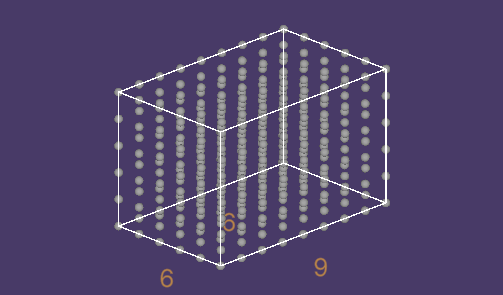
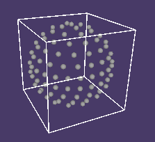
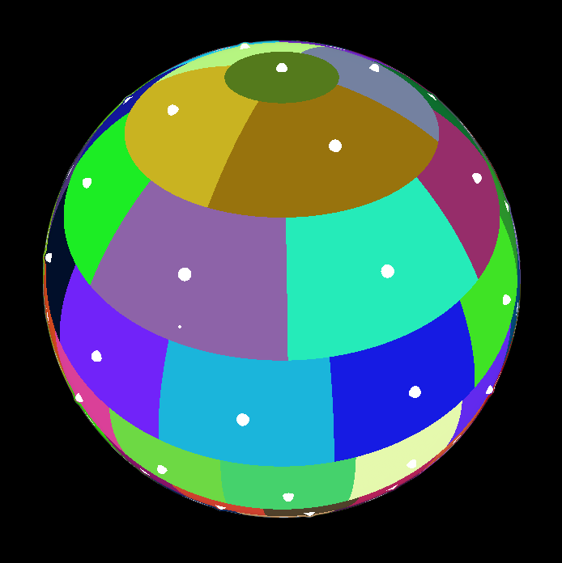
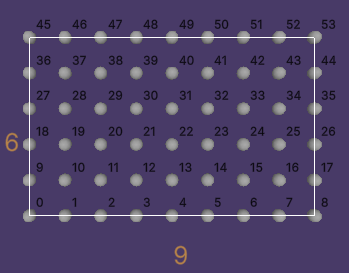
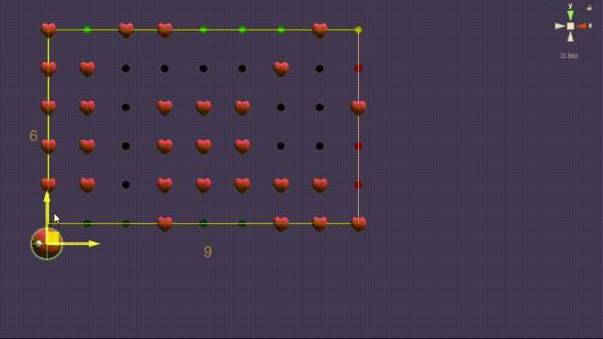

<br/><h1>Welcome to EZ Indexing!</h1>
EZIndex is used for spatial indexing, the library can be purchased on the Unity Asset Store. This is a quick intro to the 3 domain types offered: `Grid`, `Lattice`, and `Spherical`. 

<br/><h1>Grid</h1>
Grid is the 2 dimensional indexing space and this is how you would iterate nodes in a 9x6 grid centered at the origin using `Grid`:
```C#
using EZ.Index;

var ratio = new float2(9, 6);
var total = Grid.GetTotal(ratio, Domain.Centers);
for (int n = 0; n < total; n++)
{
  var node = Grid.CenterNode(in n, in ratio);
}
```


<br/><h3>What does `Domain.Centers` do?</h3>
You may expect the `Domain` enum to be differentiating between `Grid`, `Lattice`, or `Spherical`, instead it describes the kind of coordinates the nodes have within a bounded grid or lattice. In the example above, the `Domain.Centers` argument is used for getting the node count of a grid with nodes at the center of each unit, this is because the units within their domain have unique locations within them, so sub-domains based on these locations have a different node count. `Domain` is essentially a way to choose the location in a unit as the node. There are two more locations beside the unit centers: corners and wholes. `Domain.Corners` describes the corners of each unit within the domain's bounds, think of it as the compliment of `Domain.Centers`. Centers and Corners domain is centered about the orign while Wholes is not. `Domain.Wholes` describes the integer coordinates of the domain and all coordinates components are whole numbers, this is an important one as other two are built on top of this domain!

<br/><h2>Why are the methods statically typed for each `Domain` kind?</h2>
If you didn't notice, `Grid.CenterNode(in n, in ratio)` was used to get the node. You may be wondering why it is defiend when its possible to define a `Domain` parameter and have fewer methods. The reason for this is because this library may be used for calculating billions of nodes/indices, so defining a `Domain` parameter would require using a switch statement or a conditional block in every call. Due to this limitation, `Grid` and `Lattice` deifnes static hashing/reversing methods for each `Domain` kind.

<br/><h2>`Lattice`</h2>
To achive something similar to the 6x9 grid from the `Grid` example in 3D, for example a 9x6x6 lattice, you would simply change the 2 calls to `Grid` with `Lattice`, and use a `float3` for the ratio:
```C#
var ratio = new float3(9, 6, 6);
var total = Lattice.GetTotal(ratio, Domain.Centers);
for (int n = 0; n < total; n++)
{
  var node = Lattice.CenterNode(in n, in ratio);
}
```


<br/><h2>`Spherical`</h2>
The `Spherical` domain is useful for iterating over a sphere's surface. The syntax for iterating ndoes is almost the same, except the usage of a custom struct `Angle` over the `float2` to store the angle values, and a layer based system which will be explained soon.
```C#
var layers = 10;
var total = Spherical.GetTotal(layers);
for (int n = 0; n < total; n++)
{
  var node = Spherical.GetNode(in n, in layers); // typeof(node) = Angle
}
```


<br/><h3>What is a layer based system?</h3>
It sound complex, but a layer is simply a ring of nodes, and so, `layers` is the number of node rings the sphere is made up of. The math is complex and understanding it isn't required for usage, but for a sphere with 10 layers, there are exactly 102 nodes: 1 north pole node (index 0), 1 south pole node (index 101), and 50 nodes in each hemisphere (index [1, 100]). Each ring going towards the equator has 4 more nodes than the previous ring, not including the poles.

<br/>Here is a visual example of this method in [Shader Toy](https://www.shadertoy.com/view/NtKyWV).
<br/>

<br/><h2>Node Hashing</h2>
This library wouldn't be complete if it didn't include a way to get the index when given a node, so below is an example.
A possible use case for node hashing is implementing player power-up consumeables.
```C#
var healthdrops = new Dictionary<int, GameObject>(); // Image this stores the mapping of node indices to healthdrop GOs
var node = Grid.SnapCenter(playerPosition.xy, ratio.xy); // Snap the player's position to the nearest node on the centered grid
var index = Grid.CenterIndex(node, ratio.xy); // calculate the new node's index
if (healthdrops.TryGetValue(index, out var drop)) // get the drop if it exists
{
    var closeEnough = distance(playerPosition, drop.transform.position) <= 1;
    if (closeEnough) // check if its close enough to be picked up
    {
        healthdrops.Remove(index); // consume
        Destroy(drop); // consume
    }
}
```


<br/>This is allows for less allocation and faster dictionary operations compared to using `Dictionary<Vector2, GameObject>` for doing this!
